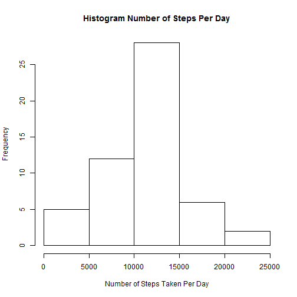
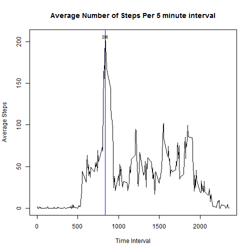
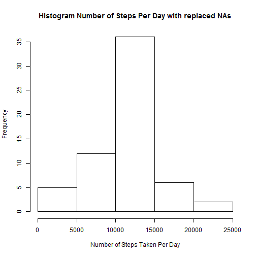

Loading and preprocessing the data
===================================
##Setup for knitr:  


```r
path = "C:/R-Working Directory/Reproducible Research/PeerAssignment1"
setwd(path)
library(knitr)
```

##Here's my download process:  


```r
if(!file.exists("./files")) { dir.create("./files")}
fileurl <- "http://d396qusza40orc.cloudfront.net/repdata%2Fdata%2Factivity.zip"
destFile <- "repdata-data-activity.zip"
download.file(fileurl, destfile=paste("files", destFile, sep="/"))
```

##Unzip the file and set the date of download:  

```r
unzip(paste("files", destFile, sep="/"), exdir="files")
data_dir <- setdiff(dir("files"), destFile)
dateDownloaded <- date()
```

##Display the date downloaded: 

```r
dateDownloaded
```

```
## [1] "Sat Dec 06 22:53:48 2014"
```

##Activity data formatted:  

```r
fullPath = paste(path, "/files/", sep="")
activityData = read.csv(paste(fullPath,"activity.csv", sep=""), stringsAsFactors=F)
activityData$date <- as.Date(activityData$date, "%Y-%m-%d")
head(activityData, 6)
```

```
##   steps       date interval
## 1    NA 2012-10-01        0
## 2    NA 2012-10-01        5
## 3    NA 2012-10-01       10
## 4    NA 2012-10-01       15
## 5    NA 2012-10-01       20
## 6    NA 2012-10-01       25
```
##What is the mean total number of steps taken per day?


```r
totalStepsPerDay <- aggregate(steps ~ date, data = activityData, sum)
meanSteps = as.integer(mean(totalStepsPerDay$steps, na.rm=TRUE))
medianSteps = as.integer(median(totalStepsPerDay$steps, na.rm=TRUE))
options(scipen=999)
```
##Plot the data as histogram

```r
hist(totalStepsPerDay$steps, main="Histogram Number of Steps Per Day", 
xlab = "Number of Steps Taken Per Day")
```

 

The mean number of steps: 10766  
The median number of steps: 10765  

##What is the average daily activity pattern?  

```r
stepsPerDay <- aggregate(steps ~ interval, data = activityData, mean)
```
##Plot the average steps per day

```r
plot(stepsPerDay$interval, 
     stepsPerDay$steps, 
     type="l",
     main="Average Number of Steps Per 5 minute interval",
      xlab="Time Interval", 
      ylab="Average Steps")
abline(v = stepsPerDay[stepsPerDay$steps == max(stepsPerDay$steps), 1],
       col="blue")
text(x = stepsPerDay[stepsPerDay$steps == max(stepsPerDay$steps), 1], 
     y = max(stepsPerDay$steps),
     labels = as.integer(max(stepsPerDay$steps)),
     cex=0.7, offset=10)
```

 

```r
maxActivity = stepsPerDay[stepsPerDay$steps == max(stepsPerDay$steps), 1]
```

The 835th interval contains the maximum number of steps per day.  

##Imputing missing values  

```r
numberNAs = sum(is.na(activityData$steps))
```

```r
newActivityData <- activityData
  for(i in 1:length(newActivityData$steps)) {
    if(is.na(newActivityData$steps[i])){
      meanActivity <- stepsPerDay[stepsPerDay$interval == newActivityData$interval[i], 2]
      newActivityData$steps[i] <- meanActivity
    }
  }
```

```r
newStepsPerDay <- aggregate(steps ~ date, data = newActivityData, sum)
newMeanSteps = as.integer(mean(newStepsPerDay$steps, na.rm=TRUE))
newMedianSteps = as.integer(median(newStepsPerDay$steps, na.rm=TRUE))
options(scipen=999)
```

##Plot the data

```r
hist(newStepsPerDay$steps, main="Histogram Number of Steps Per Day with replaced NAs", 
xlab = "Number of Steps Taken Per Day")
```

 

The number of replaced NAs: 2304      
The new mean number of steps: 10766    
The new median number of steps: 10766  

##Are there differences in activity patterns between weekdays and weekends?

```r
weekdays = c("Monday", "Tuesday", "Wednesday", "Thursday", "Friday")
weekends = c("Saturday", "Sunday")
```

```r
weekDaysLabel = vector()
newActivityData$date <- weekdays(newActivityData$date)
for(i in 1:length(newActivityData$date)){
  if(newActivityData$date[i] %in% weekdays) {
    weekDaysLabel = c(weekDaysLabel, "weekday") 
  }
  else {  
    weekDaysLabel = c(weekDaysLabel, "weekend")  
  }
  
}
newActivityData <- transform(newActivityData, weekDaysLabels = weekDaysLabel)
```

```r
meanStepsPerInterval <- aggregate(steps ~ interval + weekDaysLabels, data = newActivityData, mean)
```
##Plot the Weekday versus Weekend Graph

```r
library(lattice)
xyplot(steps ~ interval | weekDaysLabels,
       data = meanStepsPerInterval,
       type="l",
       xlab="Interval",
       ylab="Number of Steps",
       layout=c(1,2))
```

 
  
The heights of the peaks in the weekend  
graph are higher than the peaks in the   
weekday graph, except  for the one peak   
around 800. Most people sit at work  
(no stepping). On Weekends more people   
are stepping and less sitting.  


